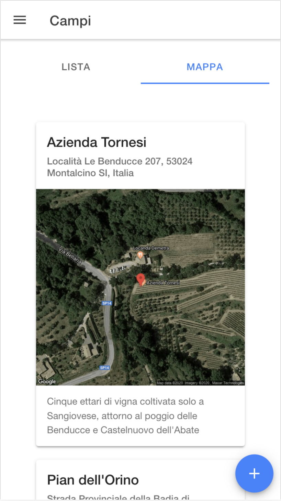
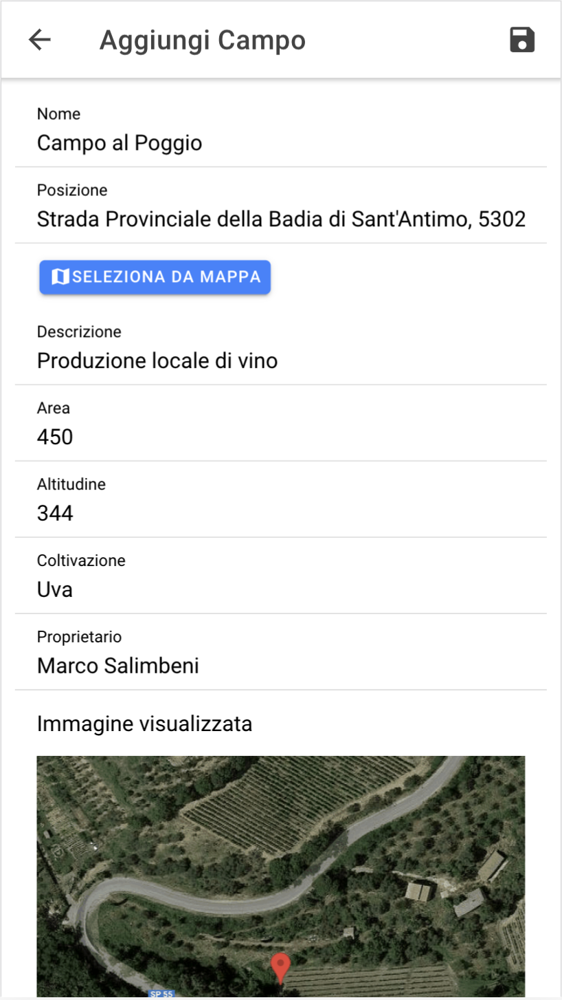
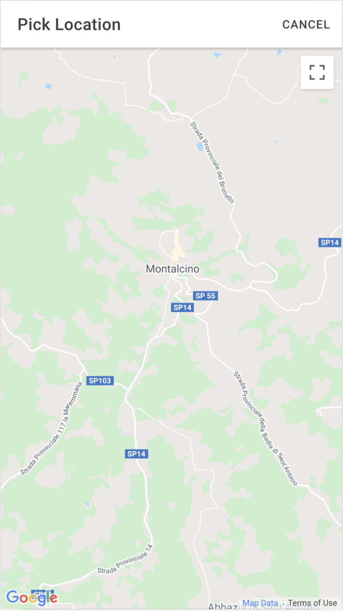
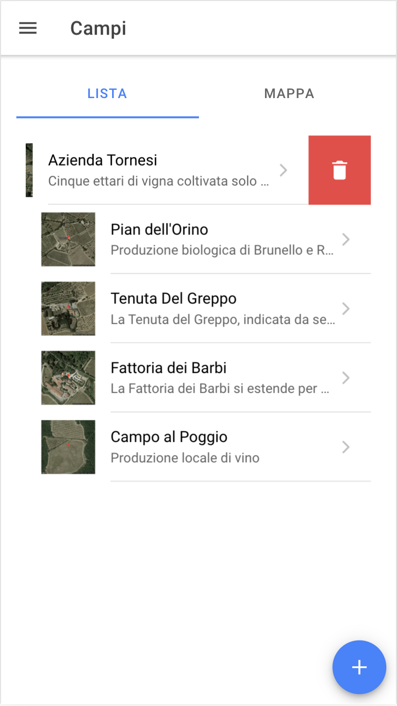

# MontalcinoApp
Simple app for the management of operations in a wine company.
For more technical information please read the docdument attached in documentation folder [italian only].

Here some screenshot:

